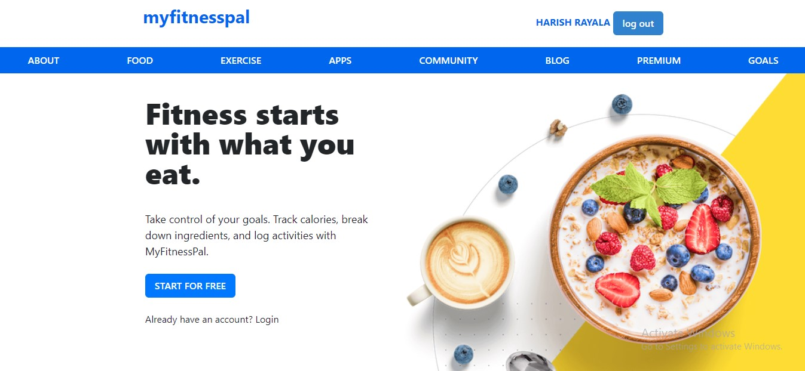
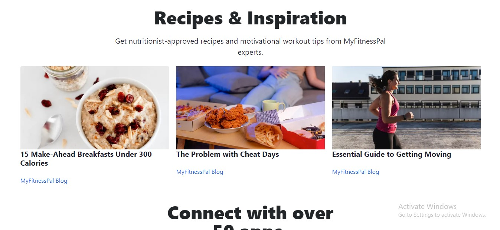
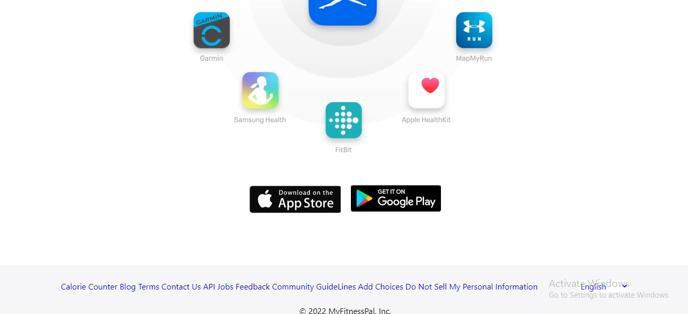
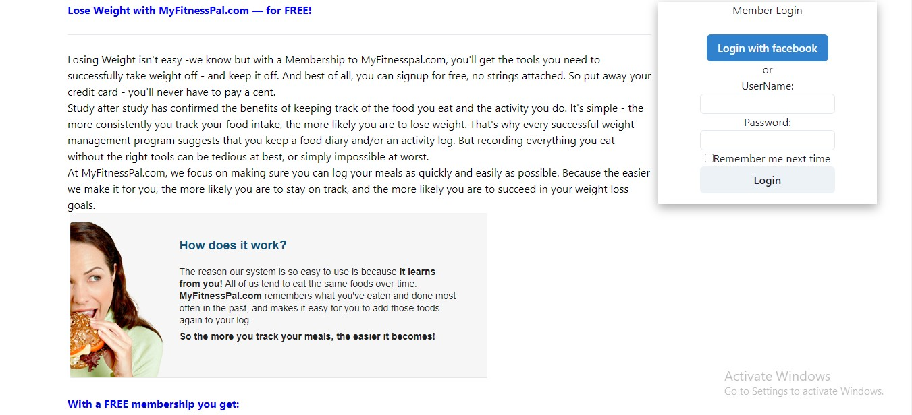
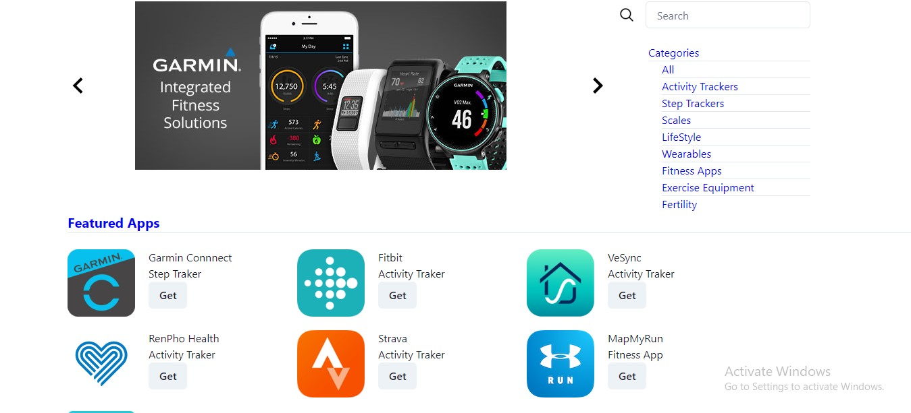
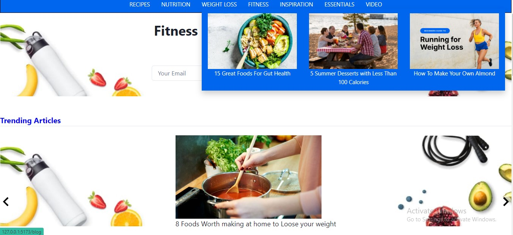
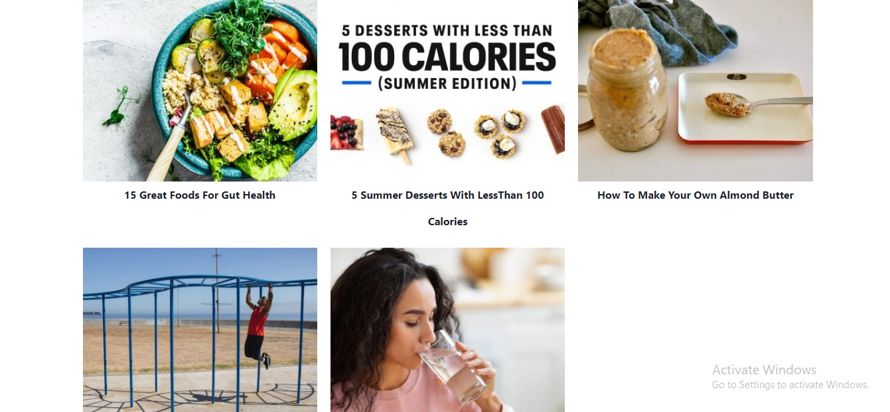

# sedate-bee-1602  
# Myfitnesspal

Welcome 👋

Project link:-https://myfitnesspal-seven.vercel.app/

This Project is an Individual Project done by me on Unit-4 Construct week at Masai School 

---

<h2>🌟Tech Stack Used🌟 </h2>

<b>*React-Js</b>
 
<b>*JavaScript</b>
 
<b>*Vanilla-CSS</b>
 
<b>*Html</b>
 
<b>*CHAKRA-UI</b>
 

<h2>🌟🌟Home Page🌟🌟</h2>

 

 

 

<h2>🌟🌟About🌟🌟</h2>

<h2>🌟🌟Apps🌟🌟</h2>

<h2>🌟🌟Blog🌟🌟</h2>

 

